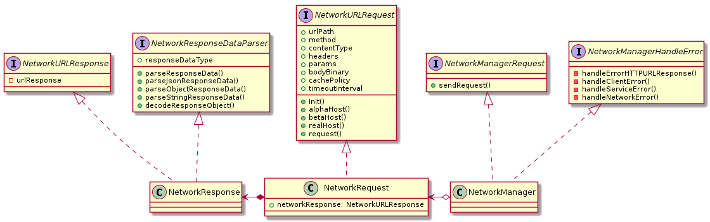

# UNNetworking



## NetworkManager
```swift
public protocol NetworkManagerRequest {
    func sendRequest(_ networkRequest: NetworkRequest, success: ((Any?) -> Void)?, fail: ((Error) -> Void)?)
}

internal protocol NetworkManagerError {
    func handleErrorHTTPURLResponse(_ response: URLResponse?, networkRequest: NetworkRequest, data: Data?, fail: ((Error) ->Void)?)
    func handleClientError(_ error: Error, networkRequest: NetworkRequest, response: URLResponse?, data: Data?, fail: ((Error) ->Void)?)
    func handleServiceError(_ error: Error, networkRequest: NetworkRequest, response: URLResponse?, data: Data?, fail: ((Error) ->Void)?)
    func handleNetworkError(_ error: NetworkError, networkRequest: NetworkRequest, response: URLResponse?, data: Data?, fail: ((Error) ->Void)?)
}
```

## NetworkRequest
```swift
public protocol NetworkURLRequest {

    var urlPath: String { get }
    var method: HttpMethod { get }
    var contentType: ContentType { get }
    var headers: Dictionary<String, String>? { get }
    var params: Dictionary<String, Any>? { get }
    var bodyBinary: Data? { get set }
    var cachePolicy: URLRequest.CachePolicy { get set }
    var timeoutInterval: TimeInterval { get set }
    
    init(urlPath: String, method: HttpMethod, contentType: ContentType)
    
    func alphaHost() -> String
    func betaHost() -> String
    func realHost() -> String
    
    func request() -> URLRequest?
}

```

## NetworkResponse
```swift
internal protocol NetworkURLResponse {
    var urlResponse: URLResponse? { get set }
}

public protocol NetworkResponseDataParser {
    var responseDataType: AnyClass? { get set }
    func parseResponseData(_ data: Data?, success: ((Any?) -> Void)?) throws
    func parseJsonResponseData(_ data: Data?, success: ((Any?) -> Void)?) throws
    func parseObjectResponseData(_ data: Data?, success: ((Any?) -> Void)?) throws
    func parseStringResponseData(_ data: Data?, success: ((Any?) -> Void)?) throws
    func decodeResponseObject(_ responseObject: Any?, success: ((Any?) -> Void)?) throws
}
```
